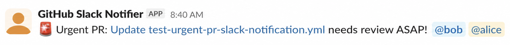

# Urgent PR Slack Notification

A GitHub Action that decides when an urgent pull request should notify reviewers in Slack.

Use it with [`kreuz123/slack-dual-notify-action`](https://github.com/kreuz123/slack-dual-notify-action) to:

- Notify pending individual reviewers when a PR receives the `urgent` label; if no individual reviewers are requested, send a channel message without mentions.
- Notify an individual reviewer added to an already urgent PR.
- Send one channel message mentioning all individual reviewers for a newly created urgent PR, while each reviewer receives their own DM.
- Render a Slack message from pull request details.

This action determines notification recipients and settings. It does not send Slack messages itself. 

## Quick start

```yaml
name: Urgent PR Slack Notification

on:
  pull_request:
    types: [labeled, review_requested]

permissions:
  pull-requests: read

jobs:
  notify_urgent:
    runs-on: ubuntu-latest
    steps:
      - name: Check urgent PR
        id: check
        uses: kreuz123/urgent-pr-slack-notification@v1

      - name: Send Slack notification
        if: steps.check.outputs.urgent == 'true'
        uses: kreuz123/slack-dual-notify-action@v1
        with:
          message-template: ${{ steps.check.outputs.message }}
          target-users: ${{ steps.check.outputs.target-users }}
          mention-users: ${{ steps.check.outputs.mention-users }}
          send-channel: ${{ steps.check.outputs.send-channel }}
          send-dm: ${{ steps.check.outputs.send-dm }}
          slack-bot-token: ${{ secrets.SLACK_BOT_TOKEN }}
          slack-channel-id: ${{ secrets.SLACK_CHANNEL_ID }}
          slack-reviewer-map: ${{ secrets.SLACK_REVIEWER_MAP }}
```

## Slack notification preview

When an urgent PR has requested reviewers, the workflow posts a channel message that mentions them:



Each requested reviewer also receives a direct message:


## Required setup

### Workflow permissions

This action reads PR details and the PR timeline. Grant:

```yaml
permissions:
  pull-requests: read
```

### Slack reviewer mapping

Configure `SLACK_BOT_TOKEN`, `SLACK_CHANNEL_ID`, and `SLACK_REVIEWER_MAP` as repository secrets for the Slack step. See [`slack-dual-notify-action` Setup](https://github.com/kreuz123/slack-dual-notify-action#setup).

`SLACK_REVIEWER_MAP` is a JSON object mapping GitHub usernames to Slack user IDs:

```json
{
  "alice": "U0123456789",
  "bob": "U9876543210"
}
```

Mapped users are mentioned by Slack ID and can receive DMs. Unmapped users are shown by GitHub username and cannot receive DMs.

## Customize the message

Add `message-template` to the `Check urgent PR` step. Keep the Slack step wired to `${{ steps.check.outputs.message }}` so it receives the rendered message.

```yaml
- name: Check urgent PR
  id: check
  uses: kreuz123/urgent-pr-slack-notification@<version>
  with:
    message-template: |
      *Urgent PR*
      Title: {{title}}
      Author: {{author}}
      Link: {{url}}
```

Supported placeholders: `{{title}}`, `{{url}}`, `{{number}}`, `{{author}}`, `{{base}}`, and `{{head}}`. Newlines are preserved.

Default message:

```text
🚨 Urgent PR: <{{url}}|{{title}}> needs review ASAP!
```

## Notification behavior

| Scenario | Notification |
| --- | --- |
| An existing PR receives the `urgent` label | Channel message mentioning pending individual reviewers, plus a DM to each. With no individual reviewers, channel message only. |
| An individual reviewer is added to an already urgent PR | Channel message mentioning the new reviewer, plus their DM. |
| A newly created urgent PR has multiple individual reviewers | One channel message mentioning all individual reviewers, plus a separate DM to each (best-effort). |
| A team review is requested | No notification from the team review request. |

Only individual reviewers are notified, including individual reviewers requested through CODEOWNERS.

A team `review_requested` event does not trigger a notification. When an `urgent` label is added, a channel message is still sent even if there are no individual reviewers (including when only teams are requested). Teams are not mentioned and do not receive DMs.

## Inputs

All inputs are optional.

| Input | Default | Description |
| --- | --- | --- |
| `urgent-label` | `urgent` | Label marking a PR as urgent; case-insensitive. |
| `message-template` | `🚨 Urgent PR: <{{url}}\|{{title}}> needs review ASAP!` | Slack message template using the supported placeholders. |
| `fresh-pr-window-seconds` | `60` | Window after PR creation for coordinating initial `urgent` and reviewer events via the PR timeline, reducing duplicate notifications. Later events use normal notification behavior. Age uses `updated_at - created_at`, falling back to execution time. |
| `github-token` | `${{ github.token }}` | Token for reading PR details and timeline; requires `pull-requests: read`. If empty, uses the event payload only. |

## Outputs

| Output | Description |
| --- | --- |
| `urgent` | `"true"` when the event should trigger an urgent Slack notification. |
| `message` | Rendered Slack message; empty when `urgent` is `"false"`. |
| `target-users` | Comma-separated GitHub usernames to receive DMs. |
| `mention-users` | Comma-separated GitHub usernames to mention in the channel; may include more reviewers than `target-users` for a newly created PR. |
| `send-channel` | `"true"` when a channel message should be sent. |
| `send-dm` | `"true"` when reviewer DMs should be sent. |

## Limitations

Notifications are **stateless and best-effort**, not guaranteed exactly once. Event/API timing can cause duplicates or missed messages, reruns can duplicate messages, and cancelled or failed workflows can miss messages. Team reviewers are not expanded into individual members.

If duplicates or misses are unacceptable, persistent shared state is necessary.

## Development

```bash
npm install
npm test
npm run lint
npm run build
```

`dist/index.js` is committed and must be rebuilt whenever `index.js` or `src/` changes.

## License

[MIT](LICENSE)
